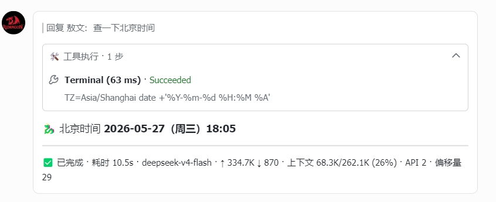
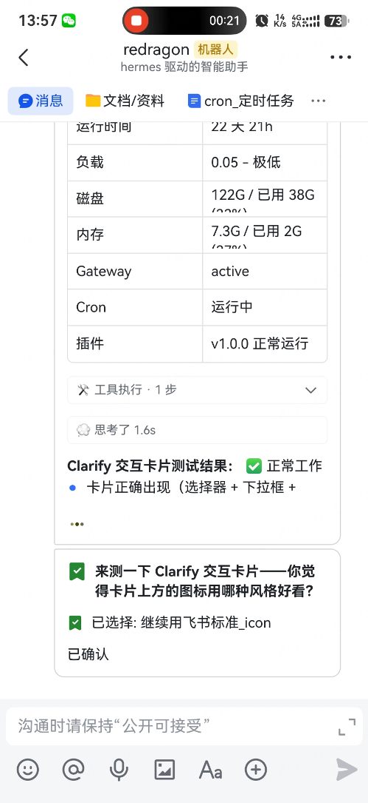

<h1 align="center">hermes-lark-streaming</h1>

<p align="center">
  
  <a href="https://opensource.org/licenses/MIT"></a>
  
  
</p>

<p align="center">
<a href="https://applink.feishu.cn/client/message/link/open?token=AmoQJk5dwczIahKlW78ADLU%3D"></a>
<a href="https://larkcommunity.feishu.cn/wiki/DKkpwgMcJiglIhk88N4cqJEan5f?from=from_copylink"></a>
</p>

<p align="center">
English | <a href="README.zh-CN.md">中文版</a>
</p>

Feishu/Lark CardKit v2.0 streaming cards plugin for Hermes Agent — real-time AI response display with typing effect, unified collapsible panel, chronological reasoning/tool display, and more.

> Based on [Cheerwhy/hermes-lark-streaming](https://github.com/Cheerwhy/hermes-lark-streaming) v0.7.0, with extensive refactoring and optimizations
>
> ⚠️ **Incompatible with the upstream plugin** — if you have the original `Cheerwhy/hermes-lark-streaming` installed, please uninstall it first before installing this version.

---

## ✨ What's New in v1.0.2 — Unified Panel Architecture

**Complete redesign of the card element architecture** — replaces the old segment-based approach with a single unified collapsible panel that holds all reasoning rounds and tool steps.

| Metric | Before (v1.0.1) | After (v1.0.2) |
|--------|-----------------|-----------------|
| Card elements per message | 50–100+ (N panels × 4 elements) | 3–4 total |
| Preservative seal failure rate | 100% (300314 element not found) | 0% |
| Card splitting frequency | Frequent (22 times in production) | Eliminated |
| Cascade failure chain | seal → rebuild → 300305 → compact → minimal → split | N/A |
| Streaming closure (300309) | Frequent on long conversations | Prevented (proactive TTL extension) |
| First token latency | Baseline | ~200–300ms faster |
| Default flush interval | 500ms | 200ms |

**Key architectural change**: 1 unified panel for ALL reasoning + tool calls, 1 answer streaming element — regardless of conversation length. This eliminates the element count explosion that plagued the old segment-based design.

---

## Effect Preview






---

## Quick Start

### Prerequisites

- [Hermes Agent](https://github.com/NousResearch/hermes-agent) (running, with Feishu platform configured)
- Hermes CLI with plugin system support (`hermes plugins` command available)

### Installation
> The plugin automatically reads the `HERMES_HOME` environment variable to locate the installation path (`~/.hermes` by default). No extra steps are needed for non-default paths.

**Gitee**
> Choose either SSH or HTTPS:
```bash
# Gitee (SSH)
hermes plugins install git@gitee.com:Aowen-Nowor/hermes-lark-streaming.git
# Gitee (HTTPS)
hermes plugins install https://gitee.com/Aowen-Nowor/hermes-lark-streaming
```
**GitHub**
> Choose either SSH or HTTPS:
```bash
# GitHub (SSH)
hermes plugins install git@github.com:Aowen-Nowor/hermes-lark-streaming.git
# GitHub (HTTPS)
hermes plugins install https://github.com/Aowen-Nowor/hermes-lark-streaming
```

Enter `Y` when prompted to enable the plugin, then restart the gateway:

```bash
hermes gateway restart
```

### Update

```bash
hermes plugins update hermes-lark-streaming
hermes gateway restart
```

### Uninstallation

```bash
# 1. Clean up injected config (while plugin code is still available)
HERMES_PYTHON=~/.hermes/hermes-agent/venv/bin/python3
$HERMES_PYTHON ~/.hermes/plugins/hermes-lark-streaming/__main__.py cleanup

# 2. Remove plugin
hermes plugins uninstall hermes-lark-streaming

# 3. Restart gateway
hermes gateway restart
```

> **Why direct `__main__.py` instead of `python3 -m`?** Hermes plugins are installed in directories named with hyphens (`hermes-lark-streaming`), but Python packages require underscores (`hermes_lark_streaming`). This naming mismatch means `python -m hermes_lark_streaming` fails with "No module named". Running `__main__.py` directly works around this — the script auto-registers the package.
>
> If the plugin was installed via pip, `python -m hermes_lark_streaming` works normally.

### Verify Installation

```bash
hermes plugins list
grep hermes_lark_streaming ~/.hermes/logs/agent.log
HERMES_PYTHON=~/.hermes/hermes-agent/venv/bin/python3
$HERMES_PYTHON ~/.hermes/plugins/hermes-lark-streaming/__main__.py status
$HERMES_PYTHON ~/.hermes/plugins/hermes-lark-streaming/__main__.py verify
```

> **Troubleshooting**: If no card effect appears, check: (1) `hermes plugins list` shows enabled; (2) no `*.bak` directories under `~/.hermes/plugins/`; (3) Feishu credentials are configured.

---

## Configuration

All settings go under the `hermes_lark_streaming:` section in `~/.hermes/config.yaml`. The plugin auto-injects defaults on first load; run `cleanup` before uninstalling to remove them.

> **Note**: Hermes's native `display.streaming: false` controls CLI/TUI output — unrelated to this plugin.

```yaml
hermes_lark_streaming:
  enabled: true                    # Enable streaming cards
  linear: true                     # Single-card in-place update (unified panel architecture)
  panel_expanded: false            # Keep panels expanded in completed cards
  streaming_panel_expanded: false  # Keep panels expanded during streaming
  print_strategy: delay            # "fast" (instant) or "delay" (smoother typewriter, default)
  flush_interval_ms: 200           # Card refresh interval in ms (100–2000, default 200)
  card_ttl_sec: 600               # Card alive detection timeout (seconds)
  inject_time: false               # Time awareness mode (see below)

  footer:
    show_label: false              # Show field labels
    fields:
      - [status, elapsed, model, cost, compression_exhausted]
      # Available fields:
      #   status      — Reply status (Completed / Error / Stopped)
      #   elapsed     — AI response elapsed time
      #   model       — Model name used
      #   cost        — Estimated cost with trust indicator ($0.023 est. / $0.023 actual / Free)
      #   compression_exhausted — Context window is full (⚠ Context Full)
      # Fields below are not shown by default — add them to the fields list to enable:
      #   cache       — Cache hit rate (cache_read/total_input hit%)
      #   tokens      — Token usage (↑ input ↓ output 💭 reasoning)
      #   context     — Context window usage (used/total percentage)
      #   api_calls   — Number of API calls in this session
      #   history_offset — Conversation history offset; larger = longer history, sudden decrease = context compression
      # Each inner list is one row in the footer; fields only shown when they have values
```

### Time Awareness Mode (`inject_time`)

When `inject_time: true`, the plugin prepends `<time>HH:MM:SS</time>` to each user message so the AI can perceive the current time without calling `date`. XML tags are used because LLMs understand them as metadata and won't mimic them in output. Prefix-cache safe (~6 tokens/message). See [SKILL.md](docs/SKILL.md) for full details.

### Feishu Credentials

| Priority | Source | Example |
|----------|--------|---------|
| 1 | Environment Variables | `FEISHU_APP_ID`, `FEISHU_APP_SECRET` |
| 2 | File | `~/.hermes/.env` |
| 3 | Config File | `hermes_lark_streaming.feishu.app_id` |

```bash
# ~/.hermes/.env example
FEISHU_APP_ID=cli_xxxxxx
FEISHU_APP_SECRET=xxxxxx
FEISHU_BASE_URL=https://open.feishu.cn/open-apis
```

### Reasoning Panel Display

```yaml
display:
  show_reasoning: true  # Show reasoning content in the unified panel
```

---

## Developer Guide & Changelog

> 📖 **[SKILL.md](docs/SKILL.md)** — LLM quick-start guide. Architecture, key design decisions, common pitfalls, efficient code modification guide.

> For the full version history, see [CHANGELOG.md](docs/CHANGELOG.md)

> ⚠️ **Important Notice:** The current version (v1.0.2) introduces the Unified Panel architecture, which is a breaking change from v1.0.1 and below. Please upgrade with caution!
> If you still wish to upgrade, please follow the uninstallation process to remove the old version and freshly install the new one. Do NOT upgrade via the update command!

---

## How to Submit Issues
> Please refer to the template [ISSUES_TEMPLATE.md](docs/ISSUES_TEMPLATE.md)

## Acknowledgments

[](https://github.com/joshcheng820222)
