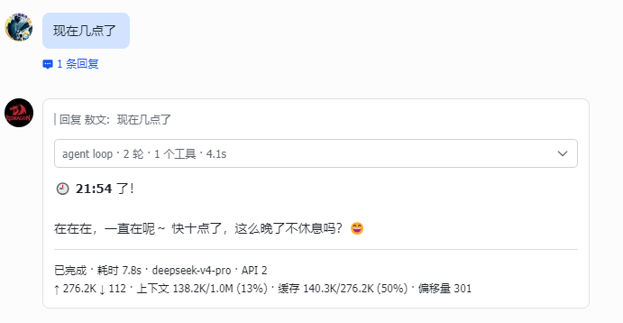
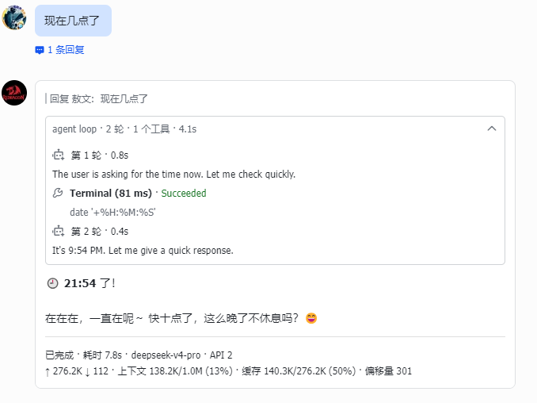
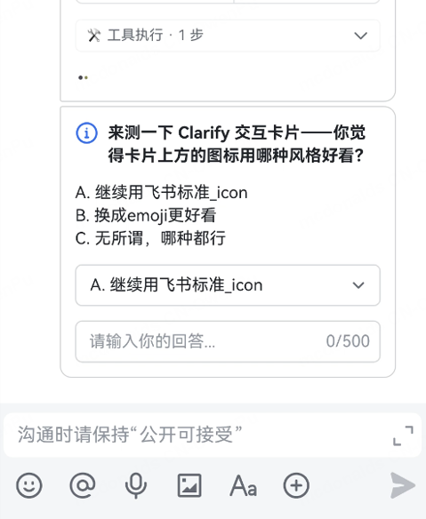
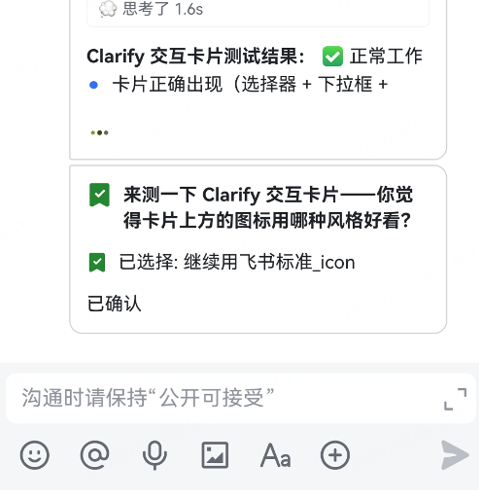

<h1 align="center">hermes-lark-streaming</h1>

<p align="center">
  
  <a href="https://opensource.org/licenses/MIT"></a>
  
  
</p>

<p align="center">
<a href="mailto:zhengyu.pu@petalmail.com"></a>
<a href="https://applink.feishu.cn/client/message/link/open?token=AmoQJk5dwczIahKlW78ADLU%3D"></a>
<a href="https://larkcommunity.feishu.cn/wiki/DKkpwgMcJiglIhk88N4cqJEan5f?from=from_copylink"></a>
</p>

<p align="center">
English | <a href="README.zh-CN.md">中文版</a>
</p>

Feishu/Lark CardKit v2.0 streaming cards plugin for Hermes Agent — real-time AI response display with typing effect, unified collapsible panel, chronological reasoning/tool display, and more.

> Based on [Cheerwhy/hermes-lark-streaming](https://github.com/Cheerwhy/hermes-lark-streaming) v0.7.0, with extensive refactoring and optimizations
>
> ⚠️ **Incompatible with the upstream plugin** — if you have the original `Cheerwhy/hermes-lark-streaming` installed, please uninstall it first before installing this version.

---

## Effect Preview

<table align="center">
  <tr>
    <td></td>
    <td></td>
    <td></td>
    <td></td>
  </tr>
</table>

---

## Quick Start

### Prerequisites

- [Hermes Agent](https://github.com/NousResearch/hermes-agent) (running, with Feishu platform configured)
- Hermes CLI with plugin system support (`hermes plugins` command available)

### Installation

> **💡 Smart Install Prompt**: Copy the following prompt to Hermes Agent, and it will automatically complete the installation:
> 
> ```
> Help me install Feishu Ao-style Cards:
> - Gitee: https://gitee.com/Aowen-Nowor/hermes-lark-streaming/raw/master/docs/AGENT_GUIDE.md
> - GitHub: https://raw.githubusercontent.com/Aowen-Nowor/hermes-lark-streaming/master/docs/AGENT_GUIDE.md
> ```

> The plugin automatically reads the `HERMES_HOME` environment variable to locate the installation path (`~/.hermes` by default). No extra steps are needed for non-default paths.

**Gitee**
> Choose either SSH or HTTPS:
```bash
# Gitee (SSH)
hermes plugins install git@gitee.com:Aowen-Nowor/hermes-lark-streaming.git
# Gitee (HTTPS)
hermes plugins install https://gitee.com/Aowen-Nowor/hermes-lark-streaming
```
**GitHub**
> Choose either SSH or HTTPS:
```bash
# GitHub (SSH)
hermes plugins install git@github.com:Aowen-Nowor/hermes-lark-streaming.git
# GitHub (HTTPS)
hermes plugins install https://github.com/Aowen-Nowor/hermes-lark-streaming
```

Enter `Y` when prompted to enable the plugin, then restart the gateway:

```bash
hermes gateway restart
```

### Update

```bash
hermes plugins update hermes-lark-streaming
hermes gateway restart
```

### Uninstallation

```bash
# 1. Clean up injected config (while plugin code is still available)
# Auto-detect Hermes Python path:
HERMES_PYTHON=$(python3 ~/.hermes/plugins/hermes-lark-streaming/__main__.py python)
$HERMES_PYTHON ~/.hermes/plugins/hermes-lark-streaming/__main__.py cleanup

# 2. Remove plugin
hermes plugins uninstall hermes-lark-streaming

# 3. Restart gateway
hermes gateway restart
```

### Verify Installation

```bash
hermes plugins list
grep hermes_lark_streaming ~/.hermes/logs/agent.log
# Auto-detect Hermes Python path:
HERMES_PYTHON=$(python3 ~/.hermes/plugins/hermes-lark-streaming/__main__.py python)
$HERMES_PYTHON ~/.hermes/plugins/hermes-lark-streaming/__main__.py status
$HERMES_PYTHON ~/.hermes/plugins/hermes-lark-streaming/__main__.py verify
$HERMES_PYTHON ~/.hermes/plugins/hermes-lark-streaming/__main__.py doctor
```

> **Troubleshooting**: If no card effect appears, check: (1) `hermes plugins list` shows enabled; (2) no `*.bak` directories under `~/.hermes/plugins/`; (3) Feishu credentials are configured. The `doctor` command provides a one-stop diagnostic covering plugin version, Python environment, config, Feishu credentials, patch status, and log paths.

---

## Configuration

All settings go under the `hermes_lark_streaming:` section in `~/.hermes/config.yaml`. The plugin auto-injects defaults on first load; run `cleanup` before uninstalling to remove them.

```yaml
hermes_lark_streaming:
  enabled: true                    # Enable streaming cards
  linear: true                     # Single-card in-place update (unified panel architecture)
  panel_expanded: false            # Keep panels expanded in completed cards
  streaming_panel_expanded: false  # Keep panels expanded during streaming
  print_strategy: delay            # "fast" (instant) or "delay" (smoother typewriter, default)
  flush_interval_ms: 100           # Card refresh interval in ms (70–2000, default 100)
  card_ttl_sec: 600               # Card alive detection timeout (seconds)
  max_tool_steps: 20               # Max tool steps shown in panel (default 20, range 1–100)
  max_reasoning_rounds: 20         # Max reasoning rounds shown in panel (default 20, range 1–100)
  inject_time: false               # Time awareness mode (see below)

  footer:
    show_label: false              # Show field labels
    fields:
      - [status, elapsed, model, cost, compression_exhausted]
      # Available fields:
      #   status      — Reply status (Completed / Error / Stopped)
      #   elapsed     — AI response elapsed time
      #   model       — Model name used
      #   cost        — Estimated cost with trust indicator ($0.023 est. / $0.023 actual / Free)
      #   compression_exhausted — Context window is full (⚠ Context Full)
      # Fields below are not shown by default — add them to the fields list to enable:
      #   cache       — Cache hit rate (cache_read/total_input hit%)
      #   tokens      — Token usage (↑ input ↓ output 💭 reasoning)
      #   context     — Context window usage (used/total percentage)
      #   api_calls   — Number of API calls in this session
      #   history_offset — Conversation history offset; larger = longer history, sudden decrease = context compression
      # Each inner list is one row in the footer; fields only shown when they have values
```

### Time Awareness Mode (`inject_time`)

When `inject_time: true`, the plugin prepends `<time>HH:MM:SS</time>` to each user message so the AI can perceive the current time without calling `date`. XML tags are used because LLMs understand them as metadata and won't mimic them in output. Prefix-cache safe (~6 tokens/message). See [SKILL.md](docs/SKILL.md) for full details.

### Reasoning Panel Display

```yaml
display:
  show_reasoning: true  # Show reasoning content in the unified panel
```

### Unified Panel Overflow Compression

Feishu Card 2.0 has a **hard limit of 200 elements/components** per card. Exceeding it triggers error `300305 (element exceeds the limit)`, which causes card sealing to fail and triggers a plain-text fallback — resulting in duplicate content visible to users.

> **Element counting rule**: Every JSON object with a `tag` property counts as 1 element, including deeply nested ones like `standard_icon`, `plain_text`, `lark_md`, etc.

#### Element Cost Breakdown

| Component | Elements | Notes |
|-----------|----------|-------|
| Panel container | 1 | `collapsible_panel` |
| Panel title | 2 | `plain_text` + `standard_icon` |
| Each reasoning round (max) | 4 | Title row `div`+`standard_icon`+`lark_md` + reasoning text `markdown` |
| Each tool step (max) | 7 | Title row `div`+`standard_icon`+`lark_md` + detail row `div`+`plain_text` + result row `div`+`lark_md` |
| Fold hint (when triggered) | 1 | 1 `markdown` element |
| Answer text | 1–3 | `markdown`; long text may be split |
| Footer | 2 | `hr` + `markdown` |
| Card header (when enabled) | ~3 | `plain_text` + `standard_icon` |
| Error panel (when present) | ~4 | `collapsible_panel` + inner elements |

**Example calculation**: 20 reasoning rounds + 20 tool steps = 20×4 + 20×7 + fixed overhead ≈ 223 (exceeds 200)

Hence the defaults `max_tool_steps=20` + `max_reasoning_rounds=20`, combined with a fold mechanism, ensure most scenarios stay within limits. Even if a higher config value or an extreme case still exceeds the cap, a built-in **card-level element safety net** kicks in — at seal time all elements are known (panel + answer + footer + error), the actual tag object count is recursively computed, and if it exceeds 195 (200 − 5 buffer), the oldest panel children are trimmed first. This guarantees the card never exceeds 200 elements. Answer, footer, and error panel are never trimmed.

#### Configuration

```yaml
hermes_lark_streaming:
  max_tool_steps: 20           # Max tool steps shown in unified panel (default 20, range 1–100)
  max_reasoning_rounds: 20     # Max reasoning rounds shown in unified panel (default 20, range 1–100)
```

When the limit is exceeded, early items are collapsed into a single summary line, e.g.: `⚡ 10 early reasoning rounds, 5 early tool steps collapsed`

The panel title always shows the **actual total** (e.g. "3 rounds · 44 tools"); the fold hint only affects what is displayed inside the panel.

### Monitor Dashboard

Send `/aowen` commands in Feishu, the plugin replies with cards directly (bypassing Hermes AI):

| Command | Description |
|---------|-------------|
| `/aowen help` | Show all available commands |
| `/aowen status` | Show plugin status + current config (collapsible panel) |
| `/aowen monitor` | Show metrics dashboard (cards created, API calls, error codes, etc.) |
| `/aowen monitor reset` | Reset metrics counters |
| `/aowen config reload` | Reload config.yaml (run after modifying config) |
| `/aowen` | Same as `/aowen help` |

> `/aowen` is the plugin's command prefix; all `/aowen` commands are handled by the plugin, not Hermes. Data is generated on-demand — zero background memory usage.

### Hot Config Reload

After modifying `~/.hermes/config.yaml`, send `/aowen config reload` in Feishu to apply immediately, or restart the gateway.

### Feishu Credentials

| Priority | Source | Example |
|----------|--------|---------|
| 1 | Environment Variables | `FEISHU_APP_ID`, `FEISHU_APP_SECRET` |
| 2 | File | `~/.hermes/.env` |
| 3 | Config File | `hermes_lark_streaming.feishu.app_id` |

```bash
# ~/.hermes/.env example
FEISHU_APP_ID=cli_xxxxxx
FEISHU_APP_SECRET=xxxxxx
FEISHU_BASE_URL=https://open.feishu.cn/open-apis
```

---

## Developer Guide & Changelog

> 📖 **[SKILL.md](docs/SKILL.md)** — LLM quick-start guide. Architecture, key design decisions, common pitfalls, efficient code modification guide.

> For the full version history, see [CHANGELOG.md](docs/CHANGELOG.md)

> ⚠️ **Important Notice:** If upgrading from v1.0.1 or below, please follow the uninstallation process to remove the old version and freshly install the new one. Do NOT upgrade via the update command!

---

## How to Submit Issues
> Please refer to the template [ISSUES_TEMPLATE.md](docs/ISSUES_TEMPLATE.md)

## Acknowledgments

[](https://github.com/joshcheng820222) [](https://github.com/xuu1998) [](https://gitee.com/joshchengjoshcheng)
